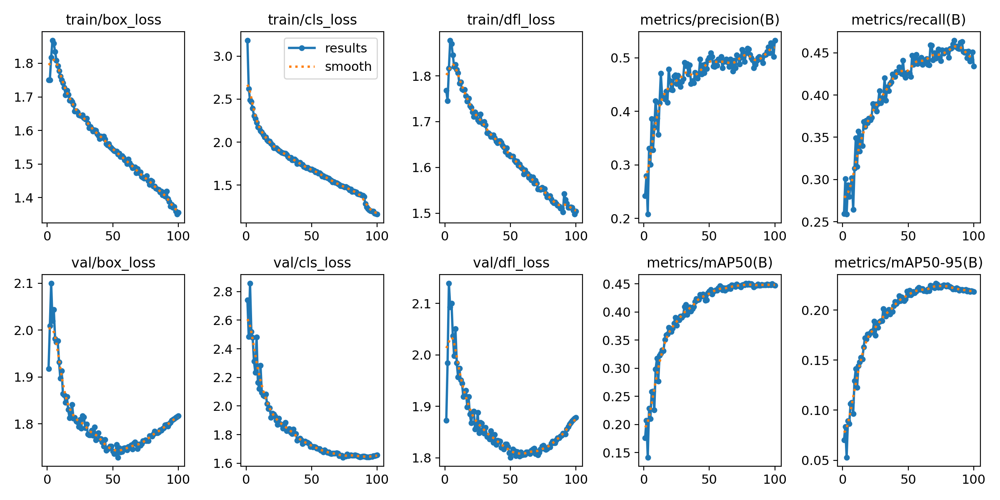

# FireGuard: 基于 YOLOv8 和 OpenCV CUDA 的火灾检测系统

本项目是一个实时火灾预警系统，利用 YOLOv8 纳米模型进行物体检测，并通过 OpenCV 的 DNN 模块在 NVIDIA GPU (CUDA) 上实现高性能推理。

## 🌟 项目亮点
- **高性能推理**：针对 RTX 4060 显卡优化，利用 CUDA 加速实现丝滑的实时监控（100+ FPS）。
- **工业级报警逻辑**：引入连续帧确认机制（需连续检测到火情才会报警），大幅降低误报率。
- **智能预警系统**：
  - **声音报警**：触发时自动发出系统蜂鸣声或预警音。
  - **自动日志**：报警瞬间自动截取带框图片并保存至 `logs/` 文件夹，方便事后回溯。
- **工程化架构**：代码采用声明与实现分离（Detector 类），逻辑清晰，易于移植到其他项目。

## 📊 训练结果分析

我们在 100 轮训练中得到了以下性能曲线：



- **收敛性**：训练集与验证集的损失函数（Loss）下降平稳，模型在第 50 轮左右达到了最佳泛化性能。
- **精准度 (mAP50)**：模型在火灾检测任务上达到了约 **0.45** 的 mAP，在识别准确率与响应速度之间取得了良好的平衡。
- **稳定性**：精确率（Precision）与召回率（Recall）表现稳定，足以应对大多数室内的明火监控场景。

## 🛠️ 环境要求
- Windows 10/11
- Visual Studio 2022 (v143/v145)
- **OpenCV 4.10.0** (需包含 CUDA 与 cuDNN 扩展编译)
- **CUDA Toolkit 11.8**
- **NVIDIA RTX 4060** (或更高配置显卡)

## 🔨 编译与运行
1. **配置路径**：修改 `CMakeLists.txt` 中的 `OpenCV_DIR` 和 `CUDA_TOOLKIT_ROOT_DIR` 为你电脑上的实际路径。
2. **构建项目**：
   ```bash
   mkdir build && cd build
   cmake ..
   cmake --build . --config Release

## 示例

